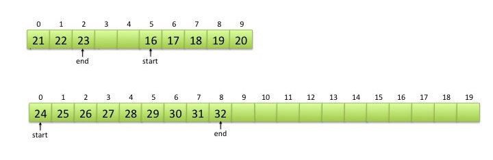

# Circular-Linked-List
Circular Linked List class in c++.  
 
 ### Introduction
 
Two common data structures for implementing First-In-First-Out (FIFO) queues are singly linked lists and arrays used as circular buffers. The advantage of using an array is that we can add and remove items from the FIFO queue quickly simply by updating the indices of the start and the end of the queue. As items are added and removed from the array, the indices would "wrap around" and space in the array is reused. In the example below, 14 is at the start of the queue and 21 is at the end. If we added another item to the FIFO queue, it would go in index #1. If we remove an item from the FIFO queue, 14 would be removed.  

When using an array for a circular buffer, we must make sure that the array is big enough to hold the largest number of items that can be in the FIFO queue simultaneously. Suppose we added two more values 22 and 23 to the circular buffer above. Then, the buffer would be full.  

We cannot add another item to the circular buffer. What do we do? The standard trick when we run out of space in an array is to make a new array that holds twice as much data and copy the data over, freeing the old array afterwards. Copying is slow, though. So, instead of copying, we will just add another array for new values, and keep both arrays. The following diagram shows what happens if we add 24, 25, 26, 27, 28 and 29 to the example above.

The resulting situation is slightly more complex than a simple expanded single array. We now have to remember that when we remove something from the FIFO queue, we remove it from the start of the old array. but when we add something to the FIFO queue, we add it to the end of the new array. For example, if we added 30, 31 and 32 and removed two items from the queue above, then we would have:  

In a simple world, eventually, all of the items in the old array will be removed and we would be left with just the new array. We then fall back to the "normal" circular buffer implemented as a single array. For example, if we removed 11 items from the figure above, we would get:  

But what if we add lots of items to the FIFO queue and even the second array fills up? Then, we just create a third array. What if that one becomes full? Then we create another one. And if that one is full? In the general case, we have a bunch of arrays. We keep track of which array is the oldest and which one is the newest. We always add to the newest array and remove from the oldest array. Once the oldest array is emptied, we can deallocate that array, and we remove items from the next oldest array. If the newest array is full, then we create another with twice the capacity. We can use a linked list to keep track of these circular buffers. Every node of the linked list has a pointer to a circular buffer. To keep track of the order of buffers we use a circular linked list. In a circular linked list, we designate a node as cursor, which is always pointing to the newest buffer. The next node of the cursor points to the oldest buffer. The following figure shows the structure.  

If we need to allocate a new buffer, we add it as a node after the current cursor and the new node will be the cursor. If we need to deallocate a buffer, in the linked list we remove the oldest node which is the next node of current cursor.  

### Class Buffer

The Buffer class implements a circular array buffer. The member variable m_buffer is a pointer to an array of integer values. The array will be defined by allocating memory dynamically. An object of Buffer class also contains the member variable m_next which is a pointer to another Buffer object. This member variable will be used by the BufferList class for implementation of the linked list.  

### Class BufferList

The class BufferList has a pointer to an object of type Buffer. The pointer is stored in the member variable m_cursor. The BufferList is a circular singly linked list. The first node of the linked list has a buffer with the size indicated by the member variable m_minBufCapacity. This value is passed through the constructor. The enqueue function inserts data into this buffer. Once the buffer is full, the enqueue function inserts a new node (Buffer object) into the linked list and starts to insert data in the new buffer. The size of the new buffer is a factor of the size of the buffer in the previous node. We use the constant global variable INCREASE_FACTOR to define the size of the new buffer. For example, if the size of the buffer is 100, and it becomes full, we create a new buffer with the size (INCREASE_FACTOR x 100).  

To limit the size of buffer arrays we use the constant global variable MAX_FACTOR. For example, if the minimum size of buffer is 100, the maximum size of a buffer cannot exceed (MAX_FACTOR x 100). As soon as we reach to the maximum size, the next buffer will be created with the minimum size which is defined by the variable member m_minBufCapacity.  

To remove data from the queue, the dequeue function removes the data from the start index in the oldest buffer of the linked list. If a buffer becomes empty, the dequeue function removes the buffer from the linked list. If there is only one node in the linked list and its buffer is empty, we do not remove the node. Always there is at least one node in the linked list.  
